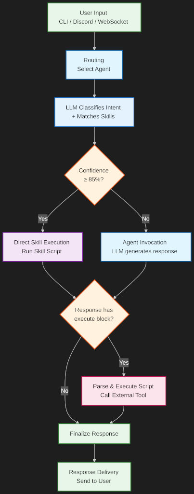

# Architecture: Request/Response Lifecycle

This document describes how a user message flows through LaraClaw — from ingestion through intent classification, agent routing, LLM invocation, and optional command execution — then back as a response.

---

## High-Level Overview

LaraClaw accepts messages from multiple transport layers and funnels them through a single processing pipeline. The pipeline classifies intent, selects an agent, builds a system prompt, calls an LLM, and optionally executes commands found in the response.



---

## Phase 1: Message Ingestion

A message enters the system through one of the transport adapters:

| Transport | Entry Point | Protocol |
|---|---|---|
| Web Client | `LaraClawServerCommand` → WebSocket | ws:// on port 19123 |
| CLI (single) | `LaraClawCommand` | Artisan command |
| CLI (shell) | `LaraClawChatCommand` | Interactive REPL |
| Discord | `LaraClawDiscordCommand` → `DiscordService` | Discord Gateway |
| HTTP API | `ChatController` | REST/JSON |
| Queue | `ProcessMessageJob` | Laravel Queue |

All transports converge into the **`CommandProcessingService`**, which normalises the input and determines whether it's a slash command, a JSON message from the web client, an `@agent` mention, or plain text for the default agent.

---

## Phase 2: Intent Classification & Skill Matching

When the message isn't a slash command, the **`RoutingService`** orchestrates classification:

1. **Explicit routing** — If the message starts with `@agent_id` or `@team_id`, routing is resolved immediately.

2. **Intent classification** — The **`IntentClassificationService`** classifies the message intent:
   - **Cache hit** (fast path): The `skill_matches` table is checked for an existing keyword signature match. If a high-confidence match exists, it's used immediately.
   - **Pattern match**: Quick regex-based classification for obvious intents (e.g., greetings, code requests).
   - **LLM classification** (slow path): If no cache hit or pattern match, the LLM is called to classify intent and match skills in a single request.

3. **Skill search** — The **`SkillSearchService`** suggests relevant skills by comparing message keywords against indexed skill definitions in the `skills` table.

4. **Agent selection** — The best agent is chosen based on intent, skills, and capabilities. The routing method is recorded (`explicit`, `intent`, `skill`, `default`).

---

## Phase 3: Prompt Assembly

The **`PromptBuilderService`** constructs the system prompt from multiple sources:

| Source | Content |
|---|---|
| `AGENTS.md` | Core agent instructions, communication protocol, team rules |
| `SOUL.md` | Agent identity, personality, worldview |
| Custom prompt | Agent-specific instructions from the `agents` table |
| Skill instructions | Available skills and how to invoke them (from `skills` table / SKILL.md files) |
| Teammate info | Dynamically injected list of teammates if the agent is on a team |
| Memory context | Relevant episodic memories and key-value facts from `episodic_memories` and `key_value_memories` |

The compiled prompt is cached per-agent (keyed by agent directory + teammates + custom prompt hash) to avoid redundant file reads.

---

## Phase 4: LLM Invocation

The **`AgentInvokerService`** calls the LLM using [Prism PHP](https://github.com/prism-php/prism):

1. Resolves the provider enum and model identifier
2. Constructs a Prism text generation request with the user message and system prompt
3. Sends the request to the configured provider (Anthropic, OpenAI, Google, Ollama, etc.)
4. Returns the raw text response

---

## Phase 5: Response Parsing & Command Execution

The **`ResponseParserService`** scans the LLM response for embedded execute blocks:

```
```execute: scripts/schedule.sh create --cron "0 9 * * *"```
```

If found, the **`ScriptExecutionService`** processes them:

1. **ScriptValidator** resolves the script path, checks the file extension whitelist, and verifies the script is inside an allowed skill directory
2. **CommandSecurityGuard** checks the assembled command against the blocked patterns list
3. **CommandBuilder** selects the interpreter (bash, python3, node, npx ts-node) and escapes arguments
4. **SandboxedExecutor** runs the command in an isolated environment with timeout enforcement and output size limits

Execution results are injected back into the response, replacing the execute blocks with formatted output.

---

## Phase 6: Response Delivery & Persistence

After the LLM response (and any command execution) is ready:

1. **Conversation recording** — A record is created/updated in the `conversations` table with the channel, sender, and team context.
2. **Message recording** — The user message and agent response are stored in `conversation_messages` with direction, agent ID, provider, and model metadata.
3. **Episodic memory** — The exchange is recorded in `episodic_memories` for future context retrieval across sessions.
4. **Response delivery** — A `CommandResponseDTO` is returned to the transport layer, which serialises it back to the client (JSON over WebSocket, formatted CLI output, Discord message, etc.).

---

## Team Conversations

When a message is routed to a **team**, the team leader agent processes it first. The agent's response may contain teammate mentions in the format `[@agent_id: directed message]`. The **`RoutingService`** extracts these mentions and the conversation handler invokes each mentioned teammate in sequence, building a collaborative response chain. Team membership is defined in the `teams` and `agent_team` pivot tables.

---

## Skill Auto-Discovery

When the intent classifier detects a gap (low-confidence skill match for an action-oriented intent), the **`SkillAutoDiscoveryService`** can:

1. **Detect the gap** via the `SkillGapDetector`
2. **Search the registry** via the `SkillRegistryClient` (`npx skills find`)
3. **Auto-install** the top match or present choices to the user
4. **Refresh** the skill index and re-classify after installation

---

## Database Tables Referenced During a Request

| Table | Used For |
|---|---|
| `agents` | Agent configuration lookup (provider, model, working directory, capabilities) |
| `teams` | Team membership and leader resolution |
| `agent_team` | Pivot table linking agents to teams |
| `settings` | Key-value settings (workspace path, default agent, channel config) |
| `skills` | Skill definitions, checksums, classification status |
| `skill_matches` | Intent→skill cache (keyword signatures, confidence scores, hit counts) |
| `conversations` | Conversation metadata (channel, sender, session tracking) |
| `conversation_messages` | Individual messages (user input + agent responses) |
| `memories` | Timestamped episodic events with importance scoring |
| `events` | System event log |
